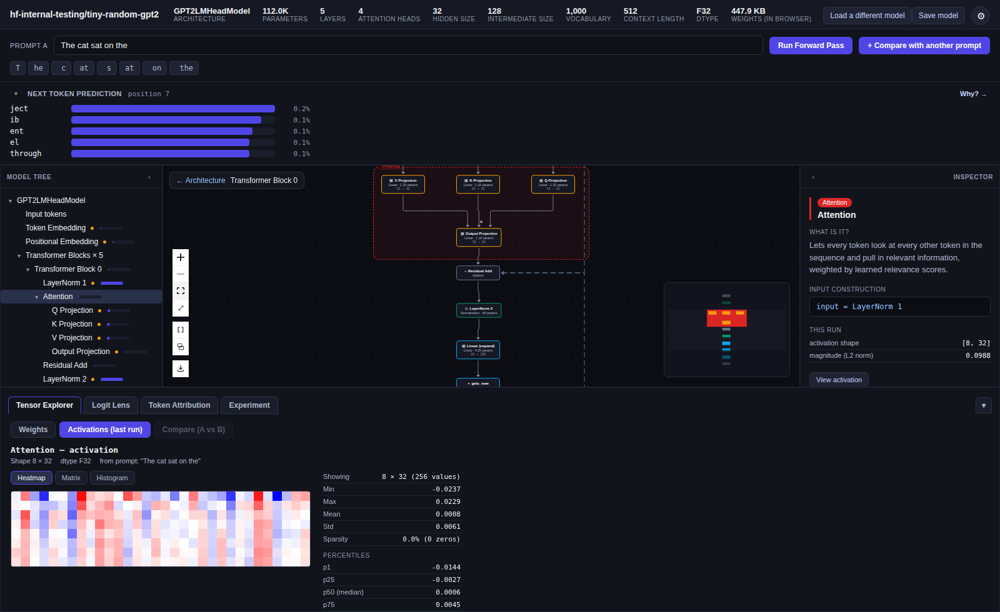

# Aperture

An interactive explorer and debugger for real large language model
internals, backed by a real GPU. Paste a Hugging Face repo id (or pick one
already downloaded); the backend fetches it, loads it onto the GPU with
actual PyTorch + `transformers`, and the frontend renders its architecture
as a navigable graph, lets you run real forward passes and streaming
generation, inspect every weight and activation, and run causal
interventions (ablate a head, patch in an activation from another prompt)
to see what actually drives the model's output — dense **and**
Mixture-of-Experts architectures alike.

Unlike a purely client-side demo, there's no size ceiling baked into the
design: the backend loads real multi-GB checkpoints (optionally 4-bit/
8-bit quantized via `bitsandbytes`) onto an actual CUDA GPU. The frontend
never receives model weights in bulk — it fetches windowed slices of
whatever tensor you're currently looking at.



> **Curious about a browser-only, no-GPU version?** Check out this
> project's sister, [Tensorium](https://nice2008x.github.io/Tensorium/)
> ([source](https://github.com/Nice2008X/Tensorium)) — though this
> GPU-backed version is more fun to actually play with.

## Features

- **Load a Hugging Face model** by repo id — any architecture registered
  with `transformers`' `AutoModelForCausalLM` and shipped as safetensors
  works via the generic graph builder below; a repo using a custom/
  non-`transformers` format or requiring `trust_remote_code` won't. The
  backend downloads it on demand into `data/models/` (progress streamed
  live), then loads it onto the GPU in bf16/fp16/fp32, or 4-bit/8-bit
  quantized via
  `bitsandbytes`. A catalog lists everything already downloaded, and one
  model stays resident on the GPU at a time (survives a page reload —
  reopening the app just re-attaches to whatever's already loaded).
- **Architecture graph** — the model rendered as a node graph (via React
  Flow) at two levels of detail: the full architecture, and a
  double-click-to-expand view of a single transformer block's internal
  wiring (attention projections, norms, MLP/MoE routing, residual adds).
  Selecting a container node (e.g. Attention) draws a scope box around its
  leaf components; a graph control collapses repeated same-type chains
  (e.g. N transformer blocks, or a MoE layer's N expert siblings) into a
  single stacked node, and toggles back to the expanded view on demand. A
  built-in export button renders the full graph (not just the visible
  viewport) to a PNG.
- **Model tree** — a classic collapsible tree view of every module and
  parameter, alongside the graph.
- **Inspector** — click any component for a plain-language explanation of
  what it does, its input/output shapes, its parameters, and (where it can
  be determined unambiguously) an Input Construction breakdown showing the
  math behind how its input was assembled (e.g. token embedding +
  positional embedding).
- **Tensor Explorer** — browse every weight tensor and every activation
  captured from the last forward pass, rendered as a heatmap, a raw
  matrix, or a value histogram. Supports windowing into large tensors and
  side-by-side A/B/diff comparison across two prompts.
- **Attention & Expert Routing views** — real per-head softmax attention
  weights for any attention block, and (for MoE models) which expert(s)
  fired per token and their gate weight, rendered as a per-token bar.
- **Streaming generation** — a real token-by-token generation loop (with
  KV caching, temperature/top-p/top-k sampling) streamed into the UI as
  each token is produced; click any generated token to jump the entire
  inspection UI (graph, tensor explorer, logit lens, attribution) to that
  exact step, using its real token ids.
- **Logit Lens** — project every layer's hidden state through the final
  norm and LM head to watch the model's next-token prediction sharpen (or
  change its mind) layer by layer.
- **Token Attribution** — occlusion-based attribution: mask each input
  token in turn and measure how much the prediction shifts, to see which
  tokens actually mattered.
- **Experiment panel** — causal interventions on a real forward pass:
  zero out a component, zero a single attention head, or patch in an
  activation captured from a second prompt, and see the before/after
  effect on the output distribution.
- **Themes and language** — dark, light, pastel, and sepia themes, plus a
  UI translated into nine languages, both configurable from the settings
  panel (top-right gear icon).
- **Resizable, collapsible layout** — drag the bottom panel's top edge to
  resize it (within sane min/max bounds); it and the tree/inspector/
  prediction panels each collapse independently, and every size/collapse
  preference persists across reloads.

## How it works

Aperture is a client/server app: a Python/GPU backend does all the real
work (loading weights, running the model, capturing activations), and the
React frontend is a thin client that renders whatever the backend hands
it over REST + SSE.

```
┌─────────────────────────┐        REST + SSE          ┌──────────────────────────────┐
│  apps/web (React)       │  ─────────────────────▶    │  apps/api (FastAPI, Python)  │
│  architecture graph,     │                            │  - model registry/loader      │
│  tree, inspector,        │  ◀─────────────────────    │  - generic IR builder          │
│  tensor explorer,        │   JSON (graph/meta) +      │  - forward-pass runner         │
│  experiment panel, ...   │   binary tensor payloads   │  - hook-based capture +        │
└─────────────────────────┘                             │    intervention support        │
                                                          │  - streaming generation        │
                                                          │  - HF download manager         │
                                                          └───────────────┬───────────────┘
                                                                          │ torch + transformers
                                                                          ▼
                                                          ┌──────────────────────────────┐
                                                          │  GPU (CUDA)                    │
                                                          └──────────────────────────────┘
                                                                          │
                                                                          ▼
                                                          data/models/<model-id>/
                                                            manifest.json, config.json,
                                                            tokenizer.*, *.safetensors
```

The core design is a normalized **Model IR** (`packages/model-ir`) —
`Model`/`ModelNode`/`ParameterRef`/`WeightProvider`/`ActivationCapture`/
`Intervention` — that every backend model gets translated into, so the UI
never has to know which architecture it's looking at. Rather than one
hand-written adapter per architecture, the backend has **one generic
graph builder** (`apps/api/src/aperture_api/graph_builder.py`) that
walks the loaded `nn.Module` tree and classifies modules by class name
into IR node types (attention, gated MLP, MoE router/experts, norms,
embeddings, ...), registering hooks for activation capture and
interventions as it goes. Because `transformers` already implements every
architecture, dense and MoE alike, a new architecture generally needs no
new code at all — only genuinely novel module shapes need a new
classification rule.

A `ParameterRef` can also be a named *slice* of a larger underlying
tensor — the mechanism that lets the same engine model both non-fused
checkpoints and checkpoints that fuse multiple projections (or, for MoE,
every expert's weights) into one on-disk tensor, without special-casing
the rest of the pipeline.

## Project layout

```
apps/
  api/                    Python/FastAPI/PyTorch backend — see apps/api/pyproject.toml.
    graph_builder.py      Generic nn.Module -> Model IR classifier (dense + MoE).
    inference.py          Forward pass + hook-based activation/attention/router capture,
                          intervention application.
    generation.py         Real streaming token-by-token generation (KV cache, sampling).
    model_registry.py     Loaded-model lifecycle, run cache.
    quantization.py       4-bit/8-bit (bitsandbytes) weight handling.
    tensors.py            Windowed tensor encoding (binary, ranges-sliced) + bulk run transport.
    downloads.py          On-demand Hugging Face download manager (data/models/).
  web/                    React + React Flow UI: tree / architecture graph / inspector /
                          tensor explorer / attention & expert-routing views / inference
                          panel / logit lens / token attribution / experiment panel /
                          generation panel / settings (themes + language).
packages/
  model-ir/               Normalized graph types: Model, ModelNode, ParameterRef,
                          WeightProvider, ActivationCapture, Intervention, ModelAdapter.
  api-client/             RemoteWeightProvider + BackendAdapter — talks to apps/api over
                          REST/SSE, decodes binary tensor + bulk-run payloads.
  tensor-core/            Tensor statistics (min/max/mean/std/percentiles) used by the
                          Tensor Explorer and histogram.
  interpretability/       Logit lens and occlusion-based token/head attribution, computed
                          client-side from a run's already-captured activations.
  nn-ops/                 The small set of numeric primitives (RMSNorm/LayerNorm, linear,
                          softmax) interpretability needs to re-project a hidden state —
                          not a full forward pass anymore, see below.
  tokenizer/              From-scratch BPE tokenizer reading a loaded model's real
                          tokenizer.json (served by the backend's static mount).
  hf-client/              Legacy-leaning: still provides peekModelType (a no-op for a
                          `backend` source) and backs packages/tokenizer's fetch, but
                          most of its original HF-CDN weight-fetching/caching logic
                          from Aperture's fully-client-side design is unreachable now.
```

### Legacy packages

Aperture started as a fully client-side app that parsed `config.json` +
`.safetensors` and ran the forward pass itself in the browser with a
hand-written TypeScript numeric engine — one adapter package per
architecture family (`packages/model-adapters/*`, plus most of the
weight-fetching/parsing half of `packages/hf-client`). That's been
replaced by the GPU backend described above; `apps/web/src/adapters.ts`
now wires in only one `BackendAdapter`. `packages/model-adapters/*` (all 10
per-architecture packages, confirmed zero imports anywhere) has since been
deleted, along with its workspace entry in the root `package.json` and its
9 direct dependencies in `apps/web/package.json`. `packages/hf-client` is
still a real, imported dependency (`peekModelType` in `useModel.ts`,
`fetchJson`/`fetchArrayBuffer` backing `packages/tokenizer`'s real
`tokenizer.json` fetch) — trimming its own unreachable-in-practice HF-CDN
fetch/cache internals is a separate, more surgical cleanup than a
zero-references package deletion, and hasn't been done.

## Getting started

### Prerequisites

- Node.js 22.12+ (see `.nvmrc`) and npm (this is an npm-workspaces monorepo)
- Python 3.12+ and an NVIDIA GPU with a recent CUDA driver
- [`uv`](https://github.com/astral-sh/uv) (recommended) or `pip`, for the
  backend's virtualenv

### Install

```bash
npm install

cd apps/api
uv venv && uv pip install -e . --extra-index-url https://download.pytorch.org/whl/cu128
# (pick the PyTorch CUDA wheel index that matches your GPU/driver)
```

### Run in development

Two processes, in separate terminals:

```bash
# backend — from apps/api, with its venv active
uvicorn aperture_api.main:app --reload --port 8000

# frontend — from the repo root
npm run dev
```

Open the printed `http://localhost:5173` URL. Paste a Hugging Face repo
id (e.g. `Qwen/Qwen2.5-3B-Instruct`) into the loader and click Load — the
backend downloads it into `data/models/` on first use, then loads it onto
the GPU. Already-downloaded models show up in the catalog for instant
reload.

### Build the frontend for production

```bash
npm run build
```

### Type-check the whole workspace

```bash
npm run typecheck
```

## Usage

1. **Load a model** — pick a catalog entry, or type a `org/model-name`
   Hugging Face repo id and click Load (triggers a download first, if
   needed). Optionally choose 4-bit/8-bit quantization.
2. **Explore the architecture** — click any node in the graph or tree to
   inspect it; double-click a transformer block to drop into its internal
   wiring, and use the breadcrumb to step back out. Toggle "Stack
   repeated nodes" to collapse repeated blocks (or, for MoE layers, expert
   siblings) into one node.
3. **Run a forward pass or generate** — type a prompt and click *Run
   Forward Pass* to populate activations throughout the graph, or
   *Generate* to stream real token-by-token output (click any generated
   token to inspect that exact step). Add a second prompt via *+ Compare
   with another prompt* to unlock A/B/diff views.
4. **Analyze** — switch between the bottom tabs:
   - **Tensor Explorer** for raw weights/activations,
   - **Logit Lens** for the evolving next-token prediction,
   - **Token Attribution** for which input tokens mattered,
   - **Experiment** for causal interventions (zero/patch a component or
     head and see the effect on the output).
5. **Customize** — open the settings panel (gear icon, top-right) to
   switch theme or UI language.

## Verifying correctness

Every stage — graph construction, forward-pass activation capture,
attention weights, interventions, quantized dequantization, generation,
and MoE router/expert capture — is checked against real output from the
same model loaded directly with PyTorch/`transformers`, including
cross-checks against genuine `register_forward_hook`/
`register_forward_pre_hook` behavior, not just this project's own
reimplementation of the same idea.

## Known limitations

- Single GPU, one model resident at a time.
- The tokenizer runs client-side and doesn't handle every special/added
  token or SentencePiece-style whitespace-normalization edge case.
- Sliding-window attention (e.g. Mistral) isn't modeled separately from
  full causal attention.
- Token attribution is occlusion-based only — no gradient-based
  attribution.
- No persistence: downloaded models stay in `data/models/`, but
  experiments, comparisons, and logit-lens runs live only in server
  memory for the current run cache (last 5 runs) / browser tab state.
- Most of `packages/hf-client`'s original HF-CDN weight-fetching/caching
  logic is unreachable in practice (a `backend`-sourced model never needs
  it) but hasn't been trimmed out, since it's still a real, imported
  dependency, not dead code (see [Legacy packages](#legacy-packages)).

## Credits

This project only exists because of the open model architectures Hugging
Face, its community, and the `transformers`/`safetensors`/
`huggingface_hub`/`accelerate`/`bitsandbytes` maintainers make available.

The architecture graph is rendered with [React
Flow](https://reactflow.dev/).

## License

[MIT](LICENSE)
